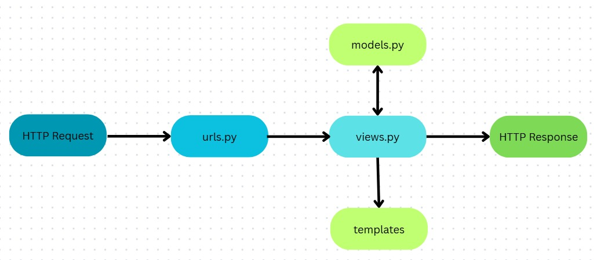

# TUGAS PBP COACH-GEAR
Nama: Muhammad Salman Fahri 
NPM: 2406343514 
Kelas: PBP F 
Link Deployment PWS: [CoachGear](https://muhammad-salman42-coachgear.pbp.cs.ui.ac.id/)

    
<b>Tugas 2</b>

## Jelaskan bagaimana cara kamu mengimplementasikan checklist di atas secara step-by-step (bukan hanya sekadar mengikuti tutorial).
Pertama-tama saya membuat repository baru di GitHub dengan nama `coach-gear`, kemudian saya clone repository tersebut ke lokal. Setelah itu saya membuka direktori hasil clone di VSCode, membuat serta mengaktifkan virtual environment untuk mengisolasi proyek dari proyek lain, lalu melakukan instalasi dependencies yang dibutuhkan. Selanjutnya saya membuat proyek Django bernama `coach_gear_site`, menambahkan konfigurasi untuk development lokal dan production deployment melalui file `.env` dan `.env.prod`, serta memodifikasi `settings.py` untuk pengaturan perizinan akses.  

Setelah itu saya membuat aplikasi `main` di direktori `coach-gear` dengan menjalankan perintah `python manage.py startapp main` dan mendaftarkannya pada proyek `coach_gear_site`. Pada aplikasi `main`, saya membuat direktori `templates` dan menambahkan file `main.html` untuk kebutuhan Tugas 2. Kemudian saya menambahkan konfigurasi routing di `coach_gear_site/urls.py` untuk aplikasi `main`, serta membuat fungsi `show_main` di `main/views.py` yang menampilkan template `main.html` berisi nama aplikasi, nama, dan kelas. Untuk melengkapinya, saya juga membuat file `main/urls.py` guna memetakan fungsi `show_main` ke aplikasinya.  

Selanjutnya saya membuat model `Product` dengan atribut berupa `name` (CharField), `price` (IntegerField), `description` (TextField), `thumbnail` (URLField), `category` (CharField), dan `is_featured` (BooleanField). Setelah model selesai dibuat, saya membuat project baru di PWS dan menyesuaikan environment dengan `.env.prod`. Pada `settings.py`, saya menambahkan URL deployment `muhammad-salman42-coachgear.pbp.cs.ui.id`. Setelah konfigurasi selesai, saya menjalankan perintah `python manage.py makemigrations` dan `python manage.py migrate` untuk mempersiapkan database. Terakhir, saya menyambungkan repository dengan PWS, menjalankan project command, melakukan build, dan melakukan push dengan perintah `git push pws master` untuk deployment.

## Buatlah bagan yang berisi request client ke web aplikasi berbasis Django beserta responnya dan jelaskan pada bagan tersebut kaitan antara 'urls.py', 'views.py', 'models.py', dan berkas html.

Ketika client mengirimkan sebuah HTTP request ke server Django, permintaan tersebut akan diproses dengan mencocokkan URL yang diminta terhadap pola yang sudah didefinisikan di dalam file `urls.py`. File ini berfungsi sebagai pengatur route yang menghubungkan URL dengan fungsi di aplikasi 'main'. Setelah URL sesuai ditemukan, request diteruskan ke `views.py`, yang bertugas mengelola logika seperti sebuah fungsi. Pada tahap ini, `views.py` dapat mengambil atau memanipulasi data melalui `models.py`, yang merupakan komponen untuk mengatur serta mengelola data aplikasi melalui database. Setelah memperoleh data yang dibutuhkan, `views.py` akan merender template HTML dengan data tersebut, sehingga menghasilkan tampilan akhir yang siap dikirimkan ke client. Hasil akhirnya berupa response HTML yang telah diproses oleh Django dan ditampilkan di browser client.

## Jelaskan peran 'settings.py' dalam proyek Django!
`settings.py` adalah file konfigurasi utama dalam sebuah proyek Django. Semua pengaturan inti proyek ditempatkan di sini, seperti konfigurasi database, daftar aplikasi yang terdaftar di `INSTALLED_APPS`, `ALLOWED_HOST`, serta konfigurasi tambahan untuk deployment. Singkatnya, file ini adalah pusat pengaturan yang mengatur bagaimana proyek Django berjalan, baik di lingkungan development maupun production.

## Bagaimana cara kerja migrasi database di Django?
migrasi di Django adalah proses untuk menjaga agar struktur database selalu sesuai dengan definisi model yang ada di aplikasi. Jadi, setiap kali kita menambahkan, mengubah, atau menghapus atribut di dalam `models.py`, Django tidak langsung mengubah database, tapi menyimpannya dulu sebagai perubahan skema.Dengan perubahan itu kemudian diterjemahkan menjadi file migration, kaya semacam catatan yang isinya instruksi tentang apa yang harus dilakukan pada database. Setelah file migrasi dibuat dengan perintah `python manage.py makemigrations`, langkah berikutnya adalah menerapkan perubahan tersebut ke database dengan perintah `python manage.py migrate`. 

Jadi cara kerja migrasi di Django bisa dipahami sebagai jembatan antara kode Python pada `models.py` dengan struktur di dalam database. Ketika perintah `python manage.py makemigrations` dijalankan, Django akan membandingkan kondisi model saat ini dengan migrasi sebelumnya, lalu membuat file migrasi baru yang berisi perubahan dari sebuah model. File migrasi ini sifatnya belum memengaruhi database, melainkan hanya mendokumentasikan rencana perubahan. Setelah itu, saat kita menjalankan `python manage.py migrate`, Django mengeksekusi isi file migrasi tersebut dengan menghasilkan query SQL yang sesuai dengan database yang digunakan, lalu menerapkannya langsung ke dalam database. Dengan cara ini, setiap perubahan data model tercatat, dapat dikelola bertahap, dan bisa di-rollback atau dijalankan ulang bila diperlukan.

## Menurut Anda, dari semua framework yang ada, mengapa framework Django dijadikan permulaan pembelajaran pengembangan perangkat lunak?
Menurut saya, salah satu alasan Django dipakai sebagai permulaan pembelajaran adalah karena framework ini sudah digunakan oleh banyak perusahaan sejak lama dan terbukti stabil. Django juga berbasis Python, bahasa pemrograman yang sudah saya pelajari sejak semester satu, sehingga lebih mudah dipahami. Selain itu, Django adalah framework full-stack yang bisa digunakan untuk mengembangkan sisi backend sekaligus menyediakan frontend melalui sistem templating HTML. Hal ini membuat Django cocok sebagai langkah awal untuk memahami pengembangan perangkat lunak secara menyeluruh, mulai dari pengolahan data hingga penyajian tampilan kepada pengguna.

Django memang bisa dipakai untuk frontend lewat templating, tapi dia bukan framework frontend murni seperti React atau Vue. Jadi lebih tepatnya Django itu framework backend dengan kemampuan templating untuk menampilkan HTML.

## Apakah ada feedback untuk asisten dosen tutorial 1 yang telah kamu kerjakan sebelumnya?
Saya tidak memiliki feedback khusus, karena tutorial 1 sudah cukup jelas dan membantu dalam memahami materi.

